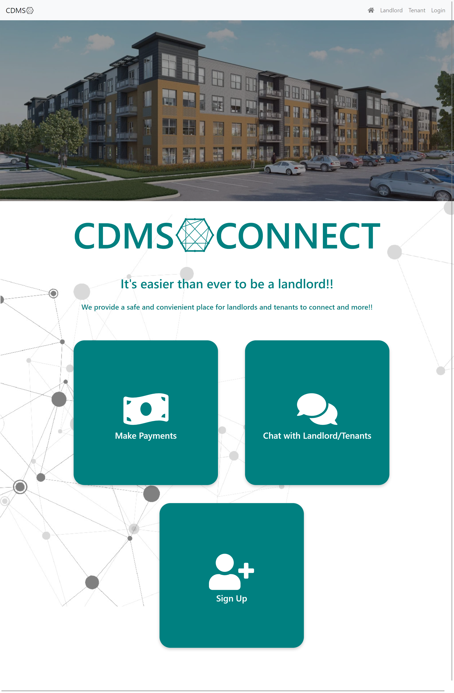
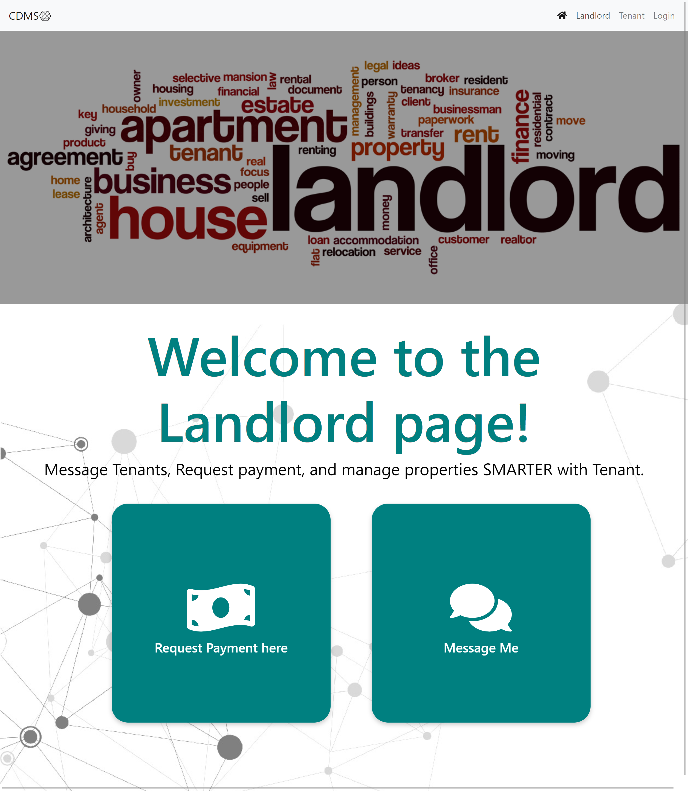
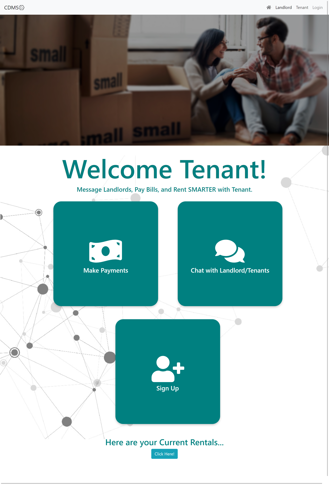
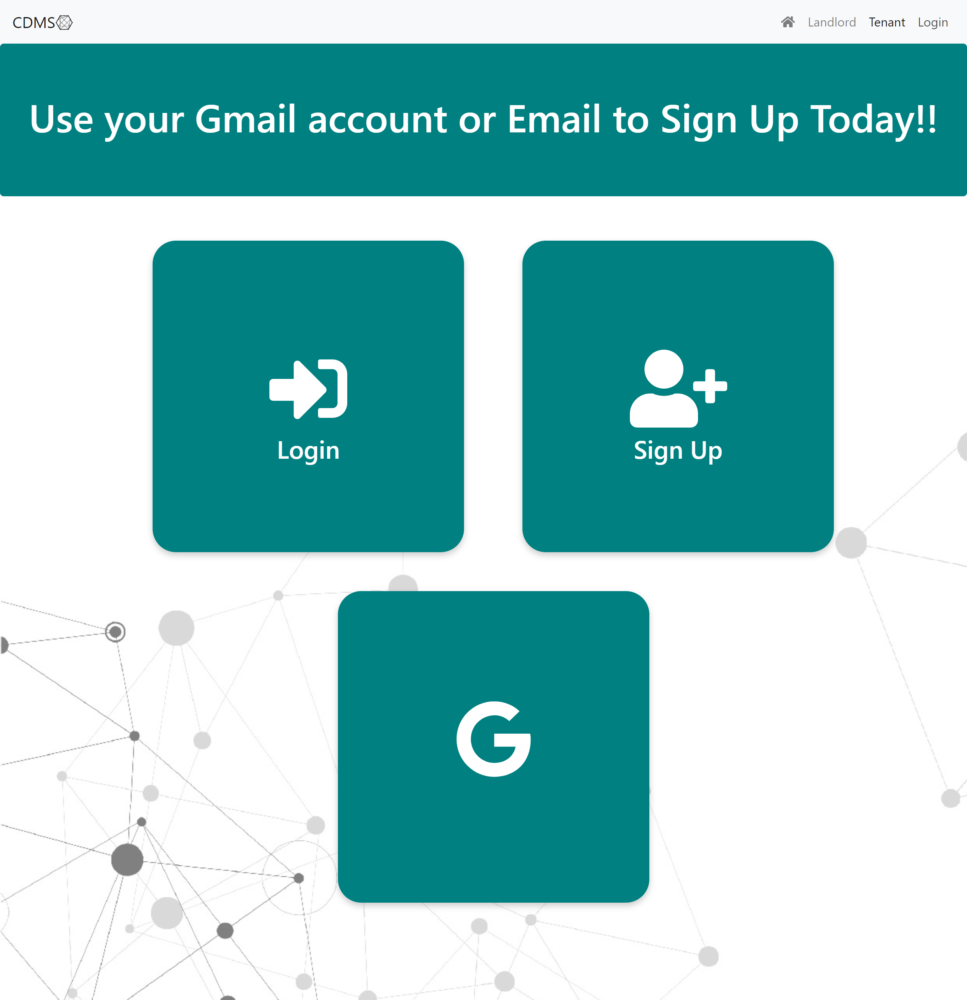

# CDMS Connect

## Description

For our final project we chose to make an application that would simplify communication between landlords and their tenants. Our app allows both landlords and tenants to create separate logins and to communicate via a chat/instant messenger. It also allows for tenants to communicate with other tenants within the same property. Tenants are also able to make payments thru our site, which the landlords can transfer directly through to their bank accounts. 

## User Story

```
As A Landlord I want to be able to see my properties, to communicate with all my tenants in one place, and collect payments safely and securely. 

As A Tenant I want to be able to communicate with my landlord and other tenants, and to be able to make payments safely and securely. 
```

## Table of Contents

* [Usage](#usage)

* [Contributing](#Contributing)

* [Heroku Link](#heroku)

* [ScreenShots of Completed App](#screenshots)

* [Collaborators](#collaborators)

* [Learn More](#learn-more)

## Usage

In the project directory, you can run:

### `npm start`

Runs the app in the development mode.\
Open [http://localhost:3000](http://localhost:3000) to view it in the browser.

The page will reload if you make edits.\
You will also see any lint errors in the console.

### `npm test`

Launches the test runner in the interactive watch mode.\
See the section about [running tests](https://facebook.github.io/create-react-app/docs/running-tests) for more information.

### `npm run build`

Builds the app for production to the `build` folder.\
It correctly bundles React in production mode and optimizes the build for the best performance.

The build is minified and the filenames include the hashes.\
Your app is ready to be deployed!

See the section about [deployment](https://facebook.github.io/create-react-app/docs/deployment) for more information.

## Contributing

If you are interested in contributing to this app please contact the owner of this repo via email. If given approval please follow these steps:

* Fork this repository.
* Create a branch: git checkout -b <branch_name>.
* Make your changes and commit them: git commit -m '<commit_message>'
* Push to the original branch: git push origin <project_name>/<location>
* Create the pull request.

Alternatively see the GitHub documentation on [creating a pull request](https://docs.github.com/en/free-pro-team@latest/github/collaborating-with-issues-and-pull-requests/creating-a-pull-request).

## Heroku

Please check out the following link to see the finished product:

[Deployed App](https://cdmstenant.herokuapp.com/home)

## ScreenShots

Home Page:


Landlord Page:


Tenant Page:


Login Page:


## Collaborators
Check Out Our Github Pages:

[Dimitar M](https://github.com/dspark8916)

[Steven G](https://github.com/sgalarza419)

[Matthew S](https://github.com/MatthewSmith23)

[Andrew C](https://github.com/Crozarts)

## Learn More

You can learn more in the [Create React App documentation](https://facebook.github.io/create-react-app/docs/getting-started).

To learn React, check out the [React documentation](https://reactjs.org/).
